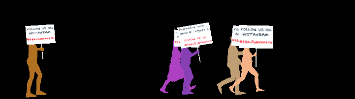

# Protest Generator v2

+ an interactive software built with Unity that allows participants to create protest signs which are then carried across the screen by virtual demonstrators. This is useful for projection, installations, and covid-safe socially-distanced protests online.



A short video of one implementation of the Protest Generator
https://user-images.githubusercontent.com/3711404/129005074-edf7e9d6-9c0b-43bb-8250-b441b6c5acd6.mp4

## To do

+ avatars have strange animation that makes it look like their feet are "sinking" as they walk
+ create a procedural avatar generator
+ handle arbitrary aspect ratio signs
+ add a repo for the online sign making app & fix the aspect ratio there

## Notes

+ Some general notes on design below

IK:

In animator Base Layer you need to enable IK checkbox

Important! 3D model rig type should be set to humanoid

Need an IKHandler script
	+ this basically taps into the existing animator (that has the IK enabled!) which, if given a valid avatar (rig should be humanoid!) knows how to employ IK.
	+ There is IK position as well as rotation. Seems like generally if character is grabbing something it should be a child object so you can fine tune rotation, etc.
	+ You can also do stuff like LookAt if you want to direct character's gaze

Filepath assumes root directory of project, but not assets folder, so specify image dir like: Assets/Resources

### To turned captured video frames into a video
```
ffmpeg -framerate 24 -i %04d\ shot.png -c:v libx264 -r 24 -pix_fmt yuv420p out.mp4
```

### To create a new protester

Make someone in Fuse, don't need animations, don't need facial blend shapes

Download then use Mixamo decimator and go to 25%

Bring in new FBX
	+ change textures to opaque
	+ drag 'Flat' material to all
	+ make sure Rig is set to Humanoid
	+ add sign post prefab
	+ Also copy 90 degree Y rotation to protester
	+ rigidbody
	+ two scripts
	+ make sure to drag correct gameobjects to new scripts
